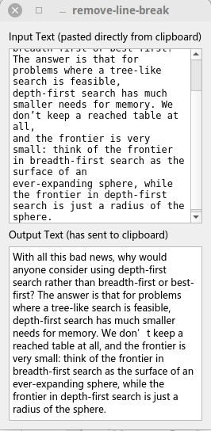

# Remove line breaks

## How to use

1. Copy text from some place, e.g., a PDF document, whose copied text usually contains quite a lot of line breaks.
2. Turn to this tiny widget. Once gaining the focus, the widget reads text directly from the clipboard, remove all line breaks, and copy the converted text back to the clipboard.
3. Paste to some place you want to.



## How to build

The widget is Qt-based:

```
qmake
make
```